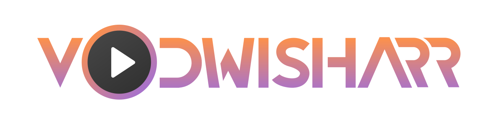
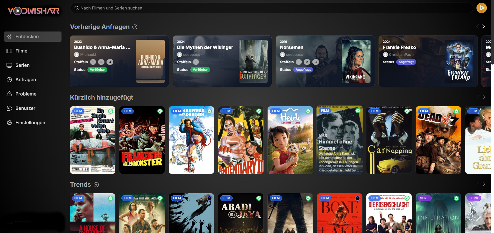

**StreamNet VOD** is a free and open source software application for managing requests for your media library. It integrates with your existing services, such as **[Sonarr](https://sonarr.tv/)**, **[Radarr](https://radarr.video/)**, and **[Plex](https://www.plex.tv/)**!

## Current Features

- Full Plex integration. Authenticate and manage user access with Plex!
- Easy integration with your existing services. Currently, StreamNet VOD supports Sonarr and Radarr. More to come!
- Plex library scan, to keep track of the titles which are already available.
- Customizable request system, which allows users to request individual seasons or movies in a friendly, easy-to-use interface.
- Incredibly simple request management UI. Don't dig through the app to simply approve recent requests!
- Granular permission system.
- Support for various notification agents.
- Mobile-friendly design, for when you need to approve requests on the go!

With more features on the way! Check out our [issue tracker](https://github.com/cyb3rgh05t/streamnetvod/issues) to see the features which have already been requested.

## Getting Started

Check out our documentation for instructions on how to install and run StreamNet VOD:

https://docs.overseerr.dev/getting-started/installation

## Preview

## Support

- Check out the [StreamNet VOD Documentation](https://docs.overseerr.dev/) before asking for help. Your question might already be in the [FAQ](https://docs.overseerr.dev/support/faq).
- You can get support on [Discord](https://discord.gg/overseerr).
- You can ask questions in the Help category of our [GitHub Discussions](https://github.com/cyb3rgh05t/streamnetvod/discussions).
- Bug reports and feature requests can be submitted via [GitHub Issues](https://github.com/cyb3rgh05t/streamnetvod/issues).

## API Documentation

Our documentation is built on every commit and hosted at https://api-docs.overseerr.dev

You can also access the API documentation from your local StreamNet VOD install at http://localhost:5055/api-docs

## Community

You can ask questions, share ideas, and more in [GitHub Discussions](https://github.com/cyb3rgh05t/streamnetvod/discussions).

If you would like to chat with other members of our growing community, [join the StreamNet VOD Discord server](https://discord.gg/overseerr)!

Our [Code of Conduct](https://github.com/cyb3rgh05t/streamnetvod/blob/master/CODE_OF_CONDUCT.md) applies to all StreamNet VOD community channels.

## Contributing

You can help improve StreamNet VOD too! Check out our [Contribution Guide](https://github.com/cyb3rgh05t/streamnetvod/blob/master/CONTRIBUTING.md) to get started.
